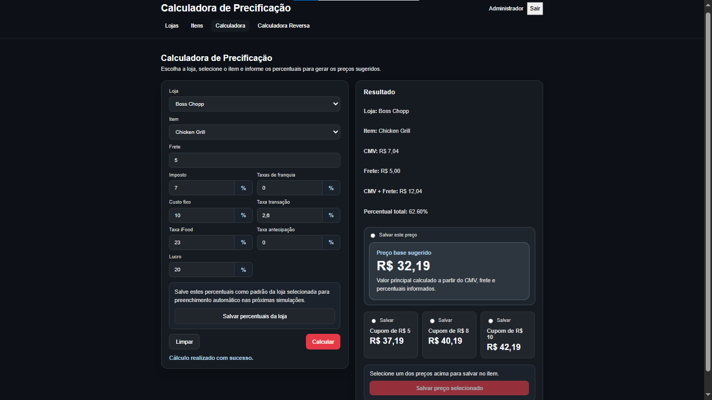
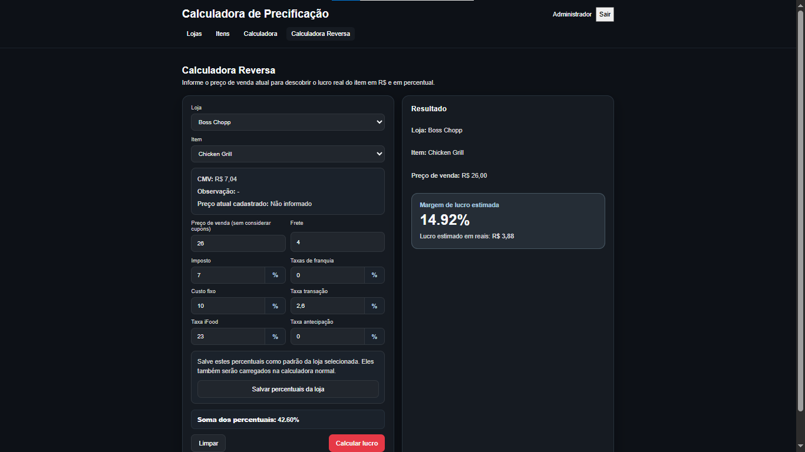
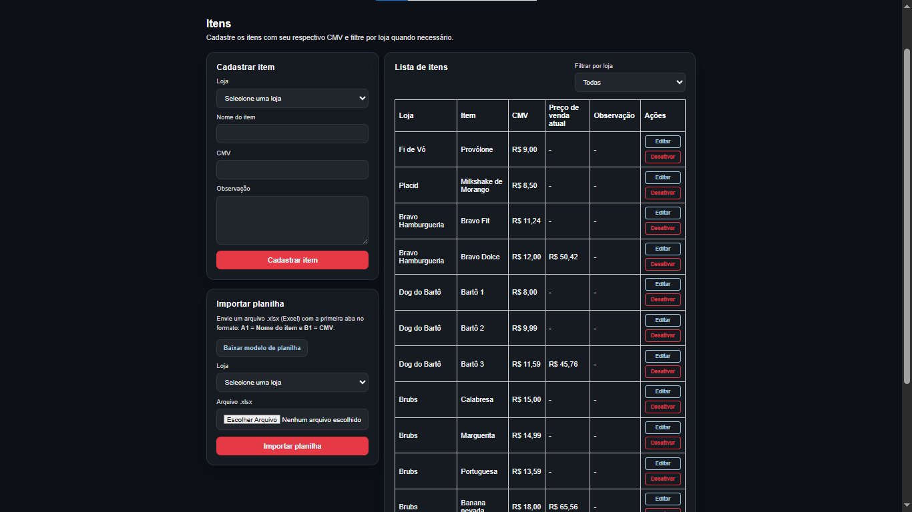

# Calculadora de Precificação

Plataforma web full stack desenvolvida para gestão estratégica de precificação de produtos em marketplaces de delivery, com foco em operações de food service e restaurantes.

O sistema foi projetado para auxiliar negócios na definição de preços de venda mais sustentáveis e lucrativos em plataformas como iFood e 99Food, considerando variáveis financeiras e operacionais que impactam diretamente a margem real dos produtos.

Atualmente, a plataforma é utilizada internamente em consultorias e mentorias de delivery voltadas para restaurantes.


## Key Features

### Pricing Engine
- Cálculo automatizado de preço ideal de venda;
- Simulação baseada em CMV, frete, taxas e margem desejada;
- Validação de cenários financeiros inviáveis;
- Persistência de parâmetros financeiros por estabelecimento.

### Reverse Pricing Analysis
- Cálculo reverso de lucratividade;
- Análise de margem nominal e percentual;
- Identificação de produtos com baixa rentabilidade;
- Suporte à reprecificação estratégica.

### Data Processing
- Importação de dados via arquivos .xlsx;
- Persistência estruturada em PostgreSQL;
- Suporte à análise operacional e financeira;

### Authentication & Security
- Sistema de autenticação;
- Gerenciamento seguro de variáveis sensíveis;

### Infrastructure
- Arquitetura containerizada com Docker;
- Deploy em servidor local com disponibilidade 24/7;
- Comunicação via REST API;
- Estrutura desacoplada entre frontend e backend.


## Tech Stack

### Backend
- Java;
- Spring Boot;
- Spring Data JPA;
- Hibernate;
- PostgreSQL.

### Frontend
- React;
- Vite;
- JavaScript ES6+.

### Infrastructure & DevOps
- Docker;
- Docker Compose.


## Architecture

```text
frontend/   → React Application
backend/    → Spring Boot REST API
database/   → PostgreSQL
```

## Business Context
A plataforma foi desenvolvida para resolver problemas reais de precificação em operações de delivery, especialmente em ambientes com:

- altas taxas operacionais;
- múltiplos marketplaces;
- diferentes estruturas de custo;
- baixa previsibilidade de margem;
- necessidade de padronização financeira.

O sistema centraliza regras de negócio e automatiza cálculos que normalmente são realizados manualmente em planilhas, reduzindo erros operacionais e aumentando a previsibilidade financeira das operações.

## Running Locally

### Requirements
- Docker;
- Docker Compose.

### Environment Setup
Crie um arquivo .env baseado em .env.example.

### Run Application
```text
docker compose up -d --build
```

## Screenshots

### Login


### Pricing Simulation


### Reverse Pricing Analysis


### Product Management


### Usage Notice

This repository is publicly available for portfolio and educational purposes.

Commercial reuse, redistribution or deployment of this project without explicit authorization is not permitted.

---


Este repositório está disponível publicamente para fins educacionais e de portfólio profissional.

A reutilização comercial, redistribuição ou implantação deste projeto sem autorização explícita não é permitida.